# Manuel utilisateur — Module Gestion des missions
**Application AppCofina**  
**Version :** juin 2026  
**Public :** tous les utilisateurs du module missions

> **Note :** ce manuel inclut des **captures d'écran** illustrant chaque écran clé. Les données affichées proviennent de l'environnement de démonstration.

---

## Table des matières

### Partie I — Manuel global
1. [Introduction](#1-introduction)
2. [Concepts clés et vocabulaire](#2-concepts-clés-et-vocabulaire)
3. [Circuit de validation](#3-circuit-de-validation)
4. [Règles de visibilité et d'accès](#4-règles-de-visibilité-et-daccès)
5. [Cycle de vie d'une mission](#5-cycle-de-vie-dune-mission)
6. [Fonctionnalités transverses](#6-fonctionnalités-transverses)
7. [Prolongation et modification de durée](#7-prolongation-et-modification-de-durée)
8. [Aspects logistiques et financiers](#8-aspects-logistiques-et-financiers)
9. [Gestion des anomalies](#9-gestion-des-anomalies)
10. [Bonnes pratiques métier](#10-bonnes-pratiques-métier)

### Partie II — Guides par profil
- [A. Collaborateur / Demandeur](#a-collaborateur--demandeur)
- [B. Missionnaire](#b-missionnaire)
- [C. N+1 (manager hiérarchique)](#c-n1-manager-hiérarchique)
- [D. DGA](#d-dga-directrice-générale-adjointe)
- [E. MD / Directeur Général](#e-md--directeur-général)
- [F. Facilities / Logistique](#f-facilities--logistique)
- [G. RH (opérationnel)](#g-rh-opérationnel)
- [H. Responsable RH (RRH)](#h-responsable-rh-rrh)
- [I. Finance (CFO)](#i-finance-cfo)
- [J. Audit](#j-audit)
- [K. Administrateur / Support](#k-administrateur--support)

### Partie III — Annexes
- [Annexe A — Matrice rôles × actions](#annexe-a--matrice-rôles--actions)
- [Annexe B — Étapes du workflow](#annexe-b--étapes-du-workflow)
- [Annexe C — Catalogue des sites](#annexe-c--catalogue-des-sites)
- [Annexe D — Index des écrans](#annexe-d--index-des-écrans)
- [Annexe E — FAQ](#annexe-e--faq)
- [Annexe F — Glossaire](#annexe-f--glossaire)
- [Annexe G — Captures d'écran](#annexe-g--captures-décran-du-manuel)

---

# Partie I — Manuel global

## 1. Introduction

### 1.1 Objet du module
Le module **Gestion des missions** permet de planifier, faire valider, équiper logistiquement, signer et clôturer les missions professionnelles des collaborateurs Cofina. Il couvre l'ensemble du cycle : de la demande initiale jusqu'au rapport de mission et à la clôture officielle.

### 1.2 Périmètre fonctionnel
- Création et soumission de demandes de mission
- Circuit de validation hiérarchique (N+1, DGA, MD)
- Traitement logistique (véhicules, chauffeurs, hébergement, frais)
- Génération et signature électronique des ordres de mission (PDF)
- Validation financière des dépenses logistiques
- Dépôt et validation du rapport de mission
- Prolongation de mission
- Tableaux de bord, récapitulatifs et historique

### 1.3 Profils utilisateurs concernés
| Profil | Rôle principal dans le module |
|--------|--------------------------------|
| Collaborateur | Demandeur, missionnaire |
| N+1 | Validation hiérarchique, correction éventuelle |
| DGA | Validation N+1 et/ou DGA |
| MD | Signature finale (DG) |
| Facilities / Logistique | Dotations, chauffeurs, frais |
| RH | Contrôle logistique, génération ordres |
| Responsable RH | Signature électronique des ordres |
| Finance | Validation des dépenses logistiques |
| Audit | Consultation complète |
| Admin | Administration applicative (sans contournement des règles missions) |

### 1.4 Prérequis
- Compte utilisateur actif dans l'application
- Profil collaborateur renseigné (pour être désigné missionnaire)
- Rattachement N+1 configuré dans le profil (pour le circuit de validation)

### 1.5 Navigation dans l'application

Le module est accessible depuis le menu latéral **Gestion des missions**. Les entrées affichées dépendent de votre profil (demandeur, validateur, Facilities, RH, etc.).

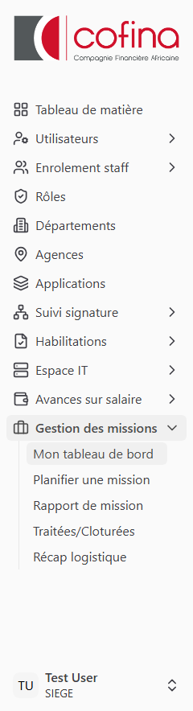

*Figure 0 — Menu latéral « Gestion des missions » (exemple : les entrées varient selon le rôle)*

---

## 2. Concepts clés et vocabulaire

### 2.1 Acteurs
- **Demandeur** : collaborateur qui crée et soumet la demande de mission.
- **Missionnaire** : collaborateur désigné pour participer à la mission (peut être le demandeur ou d'autres personnes).
- **Bénéficiaire** : premier missionnaire désigné (usage technique dans le circuit).
- **Validateur** : acteur habilité à traiter une étape (N+1, DGA, MD, Facilities, RH, RRH, Finance).

### 2.2 Numéro de mission
- Le **numéro métier** (`numero_mission`) est attribué **à la première soumission** (pas en brouillon).
- Il s'affiche sous la forme d'un entier séquentiel (ex. : 1, 2, 3…).
- Les brouillons non soumis affichent « — » à la place du numéro.

### 2.3 Statuts
| Statut | Signification |
|--------|---------------|
| `brouillon` | Demande enregistrée, non soumise |
| `en_cours` | Demande soumise, en cours de traitement |
| `renvoye` | Renvoyée au demandeur pour correction |
| `rejete` | Refusée définitivement à une étape |
| `valide` / `validee` | Validée (selon contexte d'affichage) |
| `cloture` / `cloturee` | Mission terminée officiellement |

### 2.4 Étapes du workflow (`current_step`)
| Code technique | Libellé affiché |
|----------------|-----------------|
| `BROUILLON` | Brouillon |
| `ATTENTE_N1` | En attente de validation N+1 |
| `ATTENTE_DGA` | En attente de validation DGA |
| `ATTENTE_MD` | En attente de signature DG |
| `ATTENTE_FACILITIES` | En attente de traitement Facilities |
| `ATTENTE_RH` | En attente de validation RH |
| `ATTENTE_SIGNATURE_RRH` | En attente de signature Responsable RH |
| `VALIDEE` | Validée — ordres de mission signés |
| `ATTENTE_RAPPORT` | En attente du rapport de mission signé |
| `ATTENTE_VALIDATION_RAPPORT` | En attente de validation du rapport par le demandeur |
| `CLOTUREE` | Mission clôturée officiellement |

### 2.5 Sites et descriptions
- **Sites de mission** : destinations (régions du Sénégal ou pays internationaux), sélectionnés via menus déroulants.
- **Motif par site** : description spécifique pour chaque site sélectionné.
- **Description globale** : synthèse reprise sur la fiche de validation et les ordres de mission (PDF).
- **Objet de la mission** : intitulé principal, mis en évidence sur le formulaire.

### 2.6 Documents PDF
- **Fiche de validation** : document imprimable lors des validations hiérarchiques.
- **Ordre de mission** : PDF officiel généré par la RH, signé électroniquement par le Responsable RH.
- **Ordre de prolongation** : PDF généré en cas de prolongation de la mission.

### 2.7 Journal des actions
Chaque action importante (validation, rejet, renvoi, génération PDF, signature…) est enregistrée dans l'**historique** de la mission avec l'auteur, la date et un commentaire éventuel.

---

## 3. Circuit de validation

### 3.1 Vue synoptique

```
[Demandeur]
    │
    ▼
BROUILLON ──(soumission)──► ATTENTE_N1
                                │
                                ▼
                          ATTENTE_DGA ──(ou N+1+DGA combiné)──►
                                │
                                ▼
                          ATTENTE_MD (signature DG)
                                │
                                ▼
                       ATTENTE_FACILITIES
                                │
                                ▼
                          ATTENTE_RH
                                │
                                ▼
                    ATTENTE_SIGNATURE_RRH
                                │
                                ▼
                            VALIDEE
                                │
                                ▼
                       ATTENTE_RAPPORT
                                │
                                ▼
                  ATTENTE_VALIDATION_RAPPORT
                                │
                                ▼
                           CLOTUREE
```

**Parallèle Finance :** après traitement Facilities, la mission peut être soumise à la **validation Finance** des dépenses logistiques (étape transverse, avant ou en lien avec la génération RH selon le contexte).

### 3.2 Acteurs par étape

| Étape | Acteur principal | Actions possibles |
|-------|------------------|-------------------|
| N+1 | Manager du demandeur (N+1) | Valider, rejeter, renvoyer, corriger (N+1 uniquement) |
| DGA | Directrice Générale Adjointe | Valider, rejeter, renvoyer |
| MD | Directeur Général | Signer / valider |
| Facilities | Service logistique | Chauffeurs, frais, transmission RH |
| RH | Ressources Humaines | Contrôle, aperçu PDF, génération ordre |
| RRH | Responsable RH | Signature électronique |
| Finance | CFO | Validation dépenses logistiques |
| Demandeur | Demandeur | Validation finale du rapport |

### 3.3 Cas particuliers

**Validation N+1 et DGA combinée**  
Lorsque la DGA est le N+1 direct du demandeur, une seule signature peut valider les deux niveaux (N+1 + DGA). La mission passe alors directement à l'étape MD.

**Contournement DGA**  
Dans certains cas métier, l'étape DGA peut être contournée après validation N+1 (indicateur `dga_contournee`).

**MD et DGA — sélection des missionnaires**  
Les profils MD et DGA peuvent désigner **n'importe quel collaborateur actif** comme missionnaire (sans restriction de département/rôle). Les autres demandeurs sont limités aux collaborateurs de leur département et de leur rôle.

**DGA — pas de modification**  
La DGA **ne peut pas modifier** le contenu d'une demande, même en tant que N+1. Elle peut uniquement valider, rejeter ou renvoyer.

---

## 4. Règles de visibilité et d'accès

### 4.1 Tableau de bord personnel
Chaque utilisateur voit sur **Mon tableau de bord** :
- Ses propres demandes (y compris brouillons)
- Les missions où il est **missionnaire** (après soumission, pas en brouillon)
- Les missions qu'il doit **traiter** à son niveau de validation

### 4.2 Brouillons
Les missions en brouillon ne sont visibles que par leur **demandeur**.

### 4.3 Missionnaires
Un missionnaire voit la mission une fois qu'elle est **soumise** (statut autre que brouillon). Il peut suivre l'avancement et déposer le rapport, mais ne peut pas modifier la demande.

### 4.4 Validateurs
Un validateur voit les missions en attente à **son étape** et celles qu'il a déjà traitées (historique).

### 4.5 Audit
Le profil **Audit** dispose d'une **visibilité complète** sur toutes les missions.

### 4.6 Administrateur
Le profil **Admin** ne contourne **pas** les règles de visibilité du module missions. Il voit les missions comme un utilisateur standard (ses demandes, ses missions missionnaire, ses validations).

---

## 5. Cycle de vie d'une mission

### 5.1 Création et brouillon
**Menu :** Gestion des missions → Planifier une mission

Champs obligatoires à la soumission :
- Missionnaires (au moins un)
- Objet de la mission
- Sites (au moins un) + motif par site
- Description globale
- Priorité (normale, urgente, critique)
- Dates de début et de fin

Actions :
- **Enregistrer en brouillon** : sauvegarde sans lancer le circuit (pas de numéro métier)
- **Soumettre pour validation** : lance le circuit N+1, attribue le numéro de mission

### 5.2 Soumission
À la soumission :
- Statut → `en_cours`
- Étape → `ATTENTE_N1`
- Numéro de mission attribué
- Notification envoyée au validateur N+1

### 5.3 Validations hiérarchiques
**N+1** : examine la demande, peut valider, rejeter, renvoyer ou **modifier puis valider** (correction N+1).

**DGA** : valide l'étape DGA ou valide en combinaison N+1+DGA. Ne peut pas modifier la demande.

**MD** : signature finale du Directeur Général. La mission passe ensuite en attente Facilities.

### 5.4 Traitement Facilities
Le service logistique :
- Attribue les **chauffeurs** et les missionnaires accompagnés
- Saisit les **frais** par missionnaire et par site (logement, per diems)
- Les **jours** et **nuitées** sont préremplis selon les dates (nuits = jours − 1), modifiables
- Transmet à la RH

### 5.5 Validation RH
La RH :
- Contrôle les dotations Facilities
- Prévisualise l'ordre de mission (PDF)
- Génère l'ordre et le transmet au Responsable RH pour signature

### 5.6 Signature RRH
Le Responsable RH signe électroniquement l'ordre de mission. La mission passe au statut **VALIDEE**.

### 5.7 Phase opérationnelle
Les missionnaires peuvent consulter l'ordre signé. La mission attend le **rapport de mission** avec pièces jointes éventuelles.

### 5.8 Rapport de mission
Le **missionnaire** (hors chauffeur) dépose un rapport structuré en **10 rubriques** : contexte, activités, détail par site, personnes rencontrées, résultats, écarts éventuels, difficultés, risques, recommandations et conclusion. Il signe électroniquement le document et peut joindre des pièces (PDF, images, vidéos…). Le demandeur doit ensuite **valider** le rapport pour clôturer la mission.

### 5.9 Clôture
Après validation du rapport, la mission est **clôturée officiellement** (`CLOTUREE`).

---

## 6. Fonctionnalités transverses

### 6.1 Mon tableau de bord
**Menu :** Gestion des missions → Mon tableau de bord  
**URL :** `/missions`

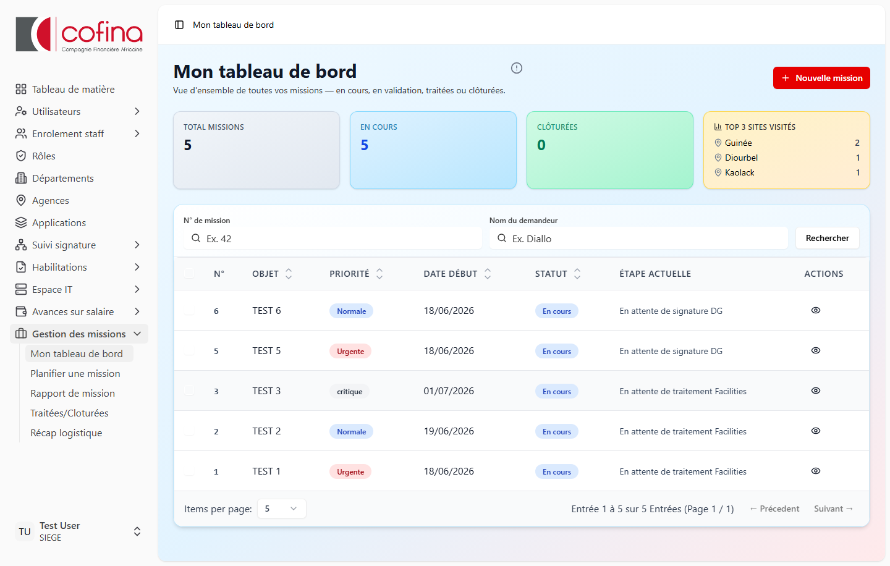

*Figure 1 — Vue d'ensemble : statistiques, top sites et liste des missions*

Affiche :
- Statistiques (total, en cours, clôturées)
- Top 3 des sites visités
- Liste paginée des missions visibles
- Actions : voir, modifier (si autorisé), supprimer (brouillon non validé)

### 6.2 Recherche
Filtres disponibles :
- **N° de mission** (numéro métier)
- **Nom du demandeur** (recherche partielle)

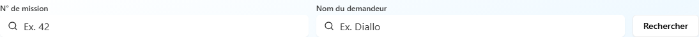

*Figure 2 — Recherche par numéro de mission et par nom du demandeur*

### 6.3 Fiche mission
**URL :** `/missions/{id}`

Contenu :
- Informations générales, missionnaires, sites, historique
- Bandeaux contextuels (brouillon, renvoyée, correction N+1…)
- Boutons d'action selon le profil et l'étape


*Figure 3 — Exemple de fiche en brouillon (bandeau bleu + actions modifier / soumettre)*

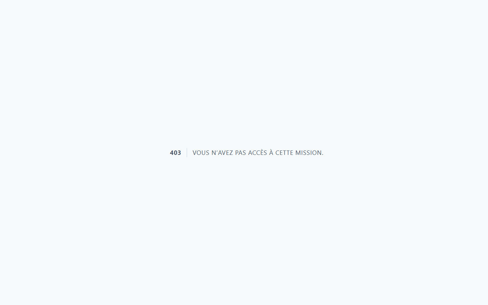

*Figure 4 — Exemple de fiche mission soumise, en attente de validation*

### 6.4 Missions traitées / clôturées
**Menu :** Gestion des missions → Traitées/Cloturées  
**URL :** `/missions/traitees`

Historique des missions terminées ou rejetées. Onglet **Récap** disponible (regroupement par semaine, mois ou année — statistiques missionnaires).

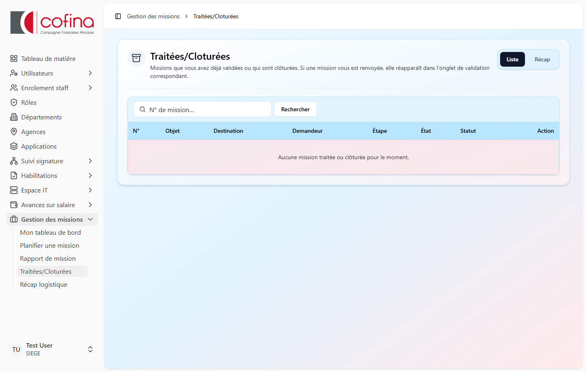

*Figure 5 — Historique des missions traitées ou clôturées*

### 6.5 Récap logistique
**URL :** `/missions/recap-logistique?context=facilities` ou `context=finance`

Synthèse des dépenses logistiques sur une **plage de dates** (date de début et date de fin). Catégories : per diems, carburant, transport, logement, autres frais.

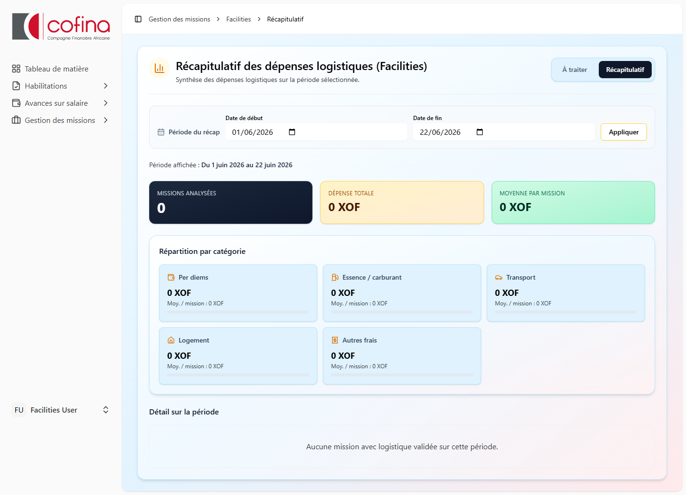

*Figure 6 — Récap logistique Facilities (sélection de la plage de dates)*


*Figure 7 — Récap logistique Finance*

### 6.6 Rapports de mission
**Menu :** Gestion des missions → Rapport de mission  
**URL :** `/missions/rapports`

Liste des missions en attente de rapport ou de validation de rapport.

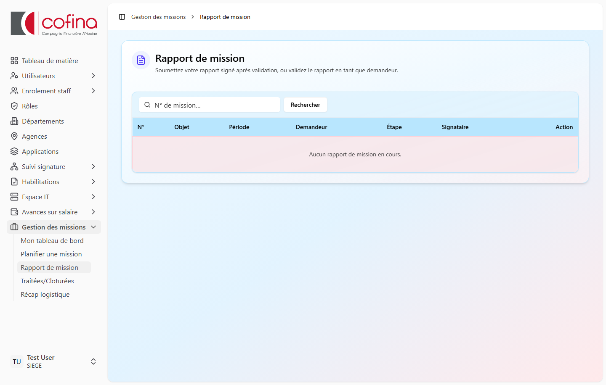

*Figure 8 — File des rapports de mission à déposer ou valider*

### 6.7 PDF et impressions
| Document | Accès |
|----------|-------|
| Fiche de validation | Validateur habilité, depuis la fiche mission |
| Aperçu ordre de mission | RH, depuis la fiche ou file RH |
| Ordre de mission signé | Demandeur, missionnaires, validateurs habilités |
| Ordre de prolongation | Idem, en cas de prolongation |

Les PDF sont **régénérés** à chaque consultation pour refléter le modèle à jour.

---

## 7. Prolongation et modification de durée

### 7.1 Principe
Une mission déjà validée peut faire l'objet d'une **prolongation** (extension de la date de fin, sites complémentaires, sélection des missionnaires conservés).

### 7.2 Circuit de reprise
La prolongation relance notamment :
- Facilities (saisie complémentaire, période initiale en lecture seule)
- RH (génération ordre de prolongation)
- Signature RRH
- Validation Finance si nécessaire

### 7.3 Calcul jours / nuits en prolongation
Pour la phase prolongation, les jours et nuitées sont calculés sur la période **du lendemain de l'ancienne date de fin** jusqu'à la **nouvelle date de fin**.

---

## 8. Aspects logistiques et financiers

### 8.1 Chauffeurs
- Ajout d'un ou plusieurs blocs chauffeur
- Sélection des missionnaires accompagnés (cases à cocher)
- Frais chauffeur : véhicule, logement, per diem, carburant, autres

### 8.2 Frais missionnaires
Par missionnaire et par site :
- **Nuitées** × prix / nuitée = total logement
- **Jours** × prix journalier = total per diem
- Autres frais

### 8.3 Règle automatique jours / nuits
À l'ouverture du traitement Facilities :
- **Jours** = nombre de jours calendaires entre date de début et date de fin (inclus)
- **Nuitées** = jours − 1
- Les montants unitaires restent **saisissables manuellement**

### 8.4 Per diems par classe (évolution prévue)
Une automatisation des tarifs par classe (cadres, non-cadres, EMC) est prévue. Les montants pourront être modifiés lors du traitement logistique.

### 8.5 Validation Finance
La Finance valide les dépenses logistiques. En cas de prolongation ou modification de durée, une **revalidation** peut être requise.

---

## 9. Gestion des anomalies

### 9.1 Mission renvoyée
Le demandeur reçoit la mission en statut `renvoye`. Il peut la **modifier** et la **resoumettre** pour validation.

### 9.2 Mission rejetée
La mission est définitivement arrêtée (`rejete`). Consultable dans l'historique.

### 9.3 Je ne vois pas une mission
Vérifier :
- S'agit-il d'un brouillon d'un autre demandeur ?
- Êtes-vous missionnaire sur une mission non encore soumise ?
- L'étape actuelle correspond-elle à votre rôle ?
- Le profil Audit voit tout ; l'admin non.

### 9.4 Pas de numéro de mission
Normal pour un **brouillon** non soumis. Le numéro est attribué à la soumission.

### 9.5 PDF ancienne version
Fermer l'onglet PDF et rouvrir, ou utiliser Ctrl+F5. Les ordres sont régénérés à chaque ouverture.

---

## 10. Bonnes pratiques métier

1. **Objet** : court, explicite, compréhensible par tous les validateurs (ex. « Audit agence Dakar »).
2. **Description globale** : synthèse claire des objectifs, reprise dans les PDF.
3. **Motif par site** : préciser la raison spécifique de chaque destination.
4. **Missionnaires** : ne désigner que les personnes réellement concernées.
5. **Dates** : cohérentes avec la durée réelle de la mission (impact sur jours/nuitées).
6. **Priorité urgente/critique** : à réserver aux cas justifiés.
7. **Rapport de mission** : déposer dans les délais avec pièces justificatives si nécessaire.

---

# Partie II — Guides par profil

## A. Collaborateur / Demandeur

### Accès
- Menu : **Gestion des missions**
- Tableau de bord : `/missions`
- Nouvelle mission : `/missions/create`

### Créer une mission
1. Cliquer sur **Planifier une mission** ou **Nouvelle mission**.
2. Sélectionner les **missionnaires** (collaborateurs de votre département, sauf si vous êtes MD/DGA).
3. Renseigner l'**objet**, la **priorité**, les **dates**.
4. Ajouter les **sites** via les menus déroulants (régions / international), puis **Ajouter**.
5. Compléter le **motif par site** et la **description globale**.
6. Choisir :
   - **Enregistrer en brouillon** (modifiable, sans numéro)
   - **Soumettre pour validation** (lance le circuit N+1)

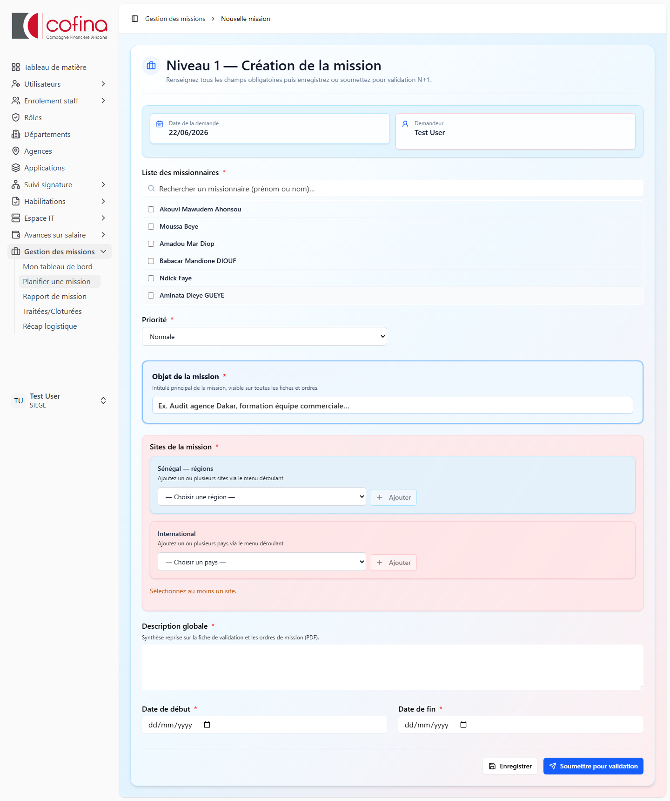

*Figure A.1 — Formulaire « Nouvelle mission »*

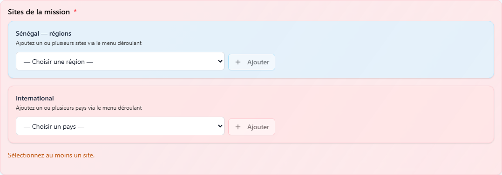

*Figure A.2 — Menus déroulants pour ajouter les sites à visiter*

### Modifier / supprimer
- **Brouillon** : modification et suppression possibles.
- **Renvoyée** : modification puis resoumission.
- **En cours de validation** : consultation seule (sauf renvoi).

### Valider le rapport
Lorsque la mission est en attente de validation du rapport, un bandeau apparaît sur la fiche. Validez le rapport déposé par le missionnaire pour clôturer la mission.

---

## B. Missionnaire

### Ce que vous voyez
- Missions où vous êtes désigné, **après soumission** (pas les brouillons d'autrui).
- Accès en **consultation** sur le tableau de bord (icône œil — « Suivre l'avancement »).

### Actions
- Consulter la fiche et l'historique
- Télécharger l'ordre de mission signé (une fois disponible)
- Déposer le **rapport de mission** structuré et pièces jointes (étape `ATTENTE_RAPPORT`) — **réservé aux missionnaires** (les chauffeurs ne soumettent pas de rapport)

### Rubriques du rapport à compléter

| Rubrique | Obligatoire |
|----------|-------------|
| Rappel du contexte et des objectifs | Oui |
| Activités réalisées | Oui |
| Détail par site visité | Oui |
| Personnes et structures rencontrées | Oui |
| Résultats obtenus et livrables | Oui |
| Écarts par rapport au planning initial | Non |
| Difficultés rencontrées | Oui |
| Risques ou incidents signalés | Non |
| Recommandations et suites à donner | Oui |
| Conclusion générale | Oui |

Chaque rubrique comporte une question guide. Après soumission, le rapport est consultable par rubrique sur la fiche mission et dans le PDF imprimable.

### Menu
- **Rapport de mission** : `/missions/rapports`


*Figure B.1 — Liste des missions en attente de rapport*

---

## C. N+1 (manager hiérarchique)

### Accès
- Menu : **Validations** → `/missions/validation/dga` (file N+1 et DGA)

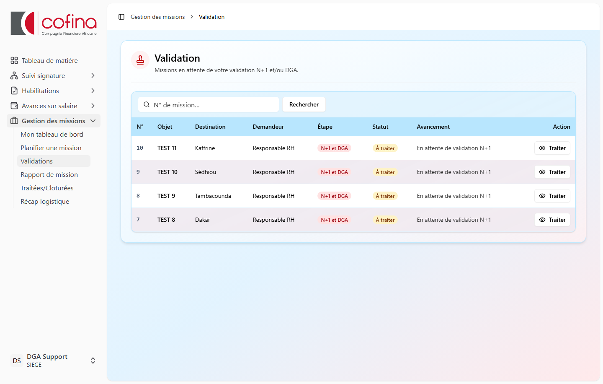

*Figure C.1 — File d'attente des validations (profil DGA / N+1)*

### Traiter une demande
1. Ouvrir la mission depuis la file d'attente.
2. Vérifier objet, sites, missionnaires, dates.
3. Actions :
   - **Valider** → passe à l'étape suivante (DGA ou MD selon cas)
   - **Renvoyer** → retour au demandeur avec commentaire
   - **Rejeter** → arrêt définitif
   - **Imprimer fiche de validation**

### Correction N+1
Si vous êtes N+1 et que la mission est à votre étape, un bandeau **Correction N+1** permet de **modifier la demande** puis de la valider vous-même sans renvoi au demandeur.

> **Note :** la DGA, même si elle est N+1, **ne dispose pas** de cette possibilité de modification.

---

## D. DGA (Directrice Générale Adjointe)

### Accès
- Menu : **Validations** → `/missions/validation/dga`


*Figure D.1 — File de validation (missions en attente N+1 et/ou DGA)*

### Rôle
- Valider les demandes à l'étape N+1 (si vous êtes le N+1 du demandeur)
- Valider l'étape DGA
- Validation **combinée** N+1 + DGA en une signature si vous êtes N+1 du demandeur

### Limitations
- **Pas de modification** du contenu de la demande
- Validation, rejet ou renvoi uniquement

### Récap logistique
Si habilitée (`peutVoirRecapLogistique`), accès via le menu ou `/missions/recap-logistique?context=finance`.

---

## E. MD / Directeur Général

### Accès
- Menu : **Validations** → `/missions/validation/md`

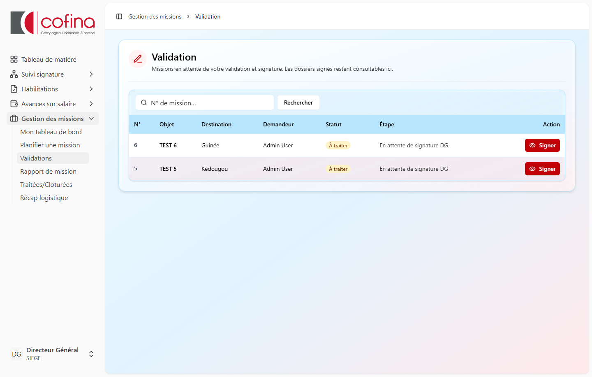

*Figure E.1 — File d'attente signature Directeur Général*

### Rôle
- Signature / validation finale avant passage en Facilities
- Lors de la **création** de mission : sélection de **tous les collaborateurs actifs** comme missionnaires

### Récap logistique
Consultation possible si habilité.

---

## F. Facilities / Logistique

### Accès
- Menu : **Dotations Logistique (Facilities)** → `/missions/validation/facilities`
- Traitement : `/missions/validation/facilities/{id}`

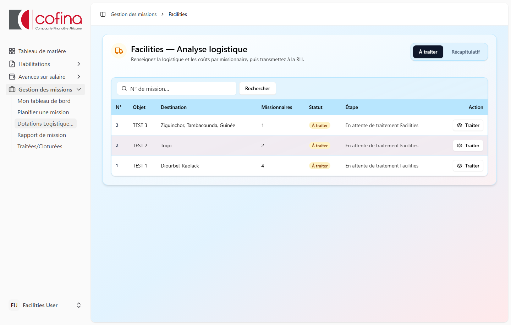

*Figure F.1 — Missions en attente de traitement logistique*

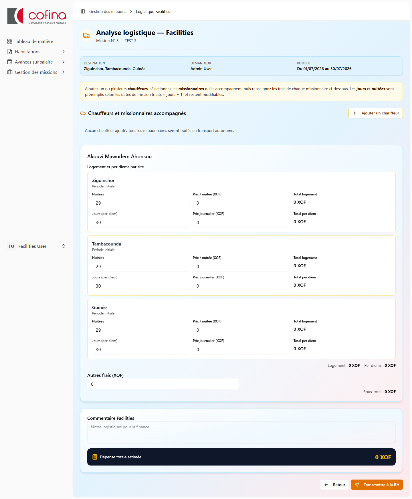

*Figure F.2 — Saisie chauffeurs, frais par site (jours/nuitées préremplis)*

### Traiter une mission
1. Ouvrir la mission depuis la file **À traiter**.
2. **Chauffeurs** (optionnel) : ajouter un chauffeur, cocher les missionnaires accompagnés, saisir véhicule et frais.
3. **Frais missionnaires** : pour chaque personne, renseigner logement et per diems **par site**.
   - Jours et nuitées sont **préremplis** (modifiables).
4. Ajouter un **commentaire Facilities** si besoin.
5. Cliquer sur **Transmettre à la RH**.

### Prolongation
Les montants de la période initiale sont en **lecture seule**. Saisir uniquement les données complémentaires pour la prolongation.

### Récapitulatif
Onglet **Récapitulatif** : choisir **date de début** et **date de fin**, puis **Appliquer**.

---

## G. RH (opérationnel)

### Accès
- Menu : **Validation RH** → `/missions/validation/rh-logistique`

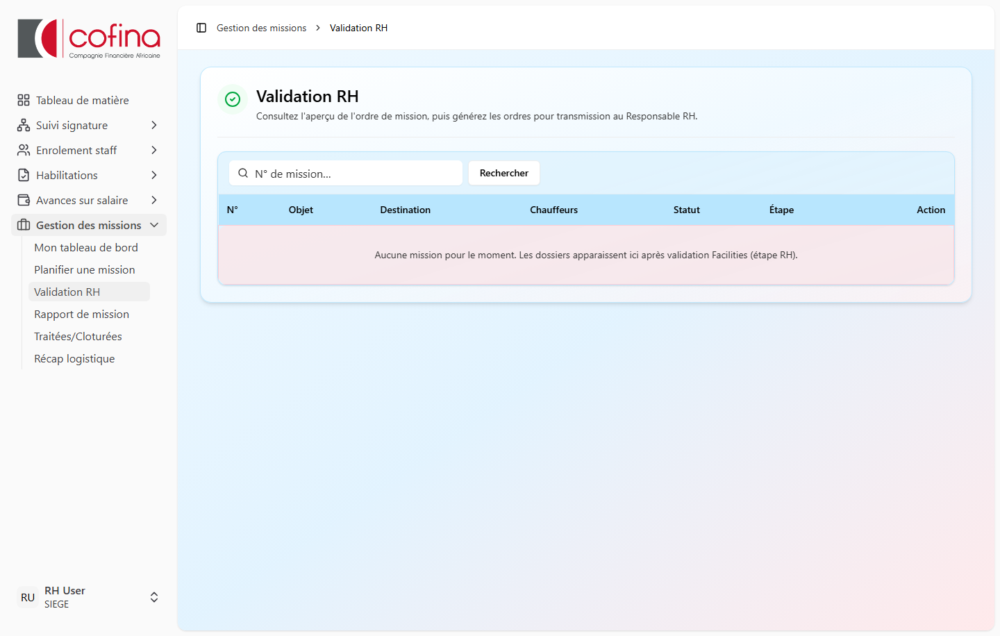

*Figure G.1 — File RH : contrôle logistique et génération des ordres*

### Actions
1. Contrôler les dotations transmises par Facilities.
2. **Aperçu** de l'ordre de mission (PDF).
3. En cas de prolongation : aperçu ordre de prolongation.
4. **Générer** l'ordre et transmettre au Responsable RH pour signature.
5. Vérifier les alertes (ex. chauffeurs manquants pour missionnaires ayant besoin d'un chauffeur).

---

## H. Responsable RH (RRH)

### Accès
- Menu : **Signature RRH** → `/missions/validation/signature-rrh`

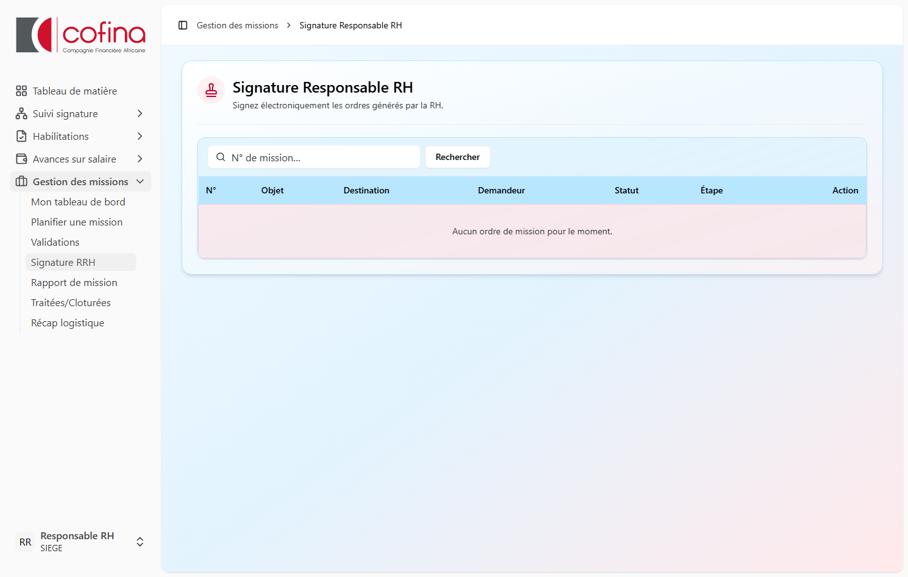

*Figure H.1 — Ordres de mission en attente de signature électronique*

### Actions
1. Consulter les ordres en attente de signature.
2. **Signer électroniquement** l'ordre de mission.
3. Signer l'**ordre de prolongation** le cas échéant.
4. La mission passe ensuite à l'étape **VALIDEE** (ou reprend son étape après prolongation).

---

## I. Finance (CFO)

### Accès
- Menu : **Validation Finance** → `/missions/validation/finance`
- Récap : `/missions/recap-logistique?context=finance`

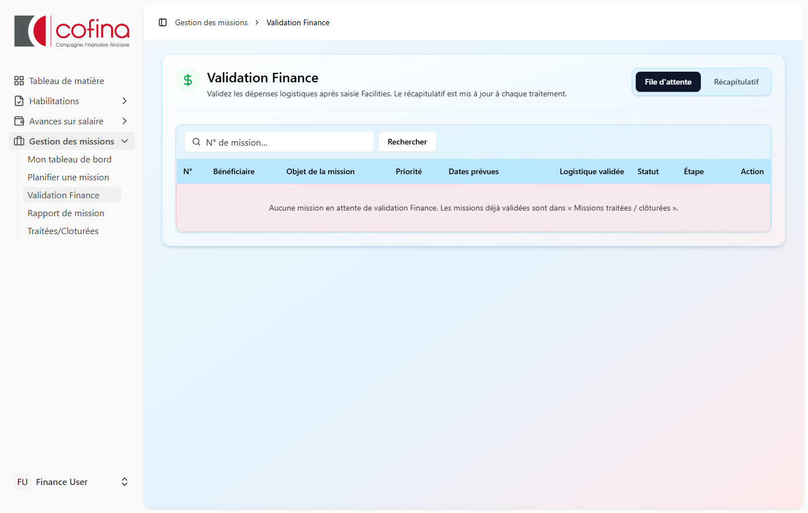

*Figure I.1 — Validation des dépenses logistiques*


*Figure I.2 — Récapitulatif des dépenses sur une plage de dates*

### Actions
1. Valider les **dépenses logistiques** des missions en file d'attente.
2. En cas de **prolongation** ou modification de durée : revalider les nouveaux montants.
3. Consulter le **récapitulatif** par plage de dates (dépenses par catégorie, moyennes par mission).

---

## J. Audit

### Accès
- Toutes les missions visibles sans restriction de filtre métier.

### Usage recommandé
- Contrôle de l'historique des validations
- Vérification de cohérence dates / montants / signatures
- Échantillonnage des missions clôturées

---

## K. Administrateur / Support

### Rappels
- L'admin **ne voit pas** toutes les missions par défaut (règles identiques aux utilisateurs).
- Seul le profil **Audit** a la visibilité complète.
- La gestion des rôles se fait dans le module **Administration** (hors périmètre de ce manuel).

### Dépannage fréquent
| Problème | Piste |
|----------|-------|
| Mission invisible | Vérifier rôle, étape, statut brouillon |
| Pas de validateur N+1 | Vérifier `n_plus_1_id` sur le profil du demandeur |
| Erreur soumission | Vérifier champs obligatoires et missionnaires autorisés |
| Numéro absent | Normal si brouillon |

---

# Partie III — Annexes

## Annexe A — Matrice rôles × actions

| Action | Demandeur | Missionnaire | N+1 | DGA | MD | Facilities | RH | RRH | Finance | Audit |
|--------|:---------:|:------------:|:---:|:---:|:--:|:----------:|:--:|:---:|:-------:|:-----:|
| Créer mission | ✓ | — | — | ✓* | ✓* | — | — | — | — | — |
| Modifier (brouillon/renvoyé) | ✓ | — | — | — | — | — | — | — | — | — |
| Modifier (correction N+1) | — | — | ✓ | — | — | — | — | — | — | — |
| Valider N+1 | — | — | ✓ | ✓** | — | — | — | — | — | — |
| Valider DGA | — | — | — | ✓ | — | — | — | — | — | — |
| Valider MD | — | — | — | — | ✓ | — | — | — | — | — |
| Traiter logistique | — | — | — | — | — | ✓ | — | — | — | — |
| Générer ordre RH | — | — | — | — | — | — | ✓ | — | — | — |
| Signer ordre | — | — | — | — | — | — | — | ✓ | — | — |
| Valider Finance | — | — | — | — | — | — | — | — | ✓ | — |
| Déposer rapport | — | ✓ | — | — | — | — | — | — | — | — |
| Valider rapport | ✓ | — | — | — | — | — | — | — | — | — |
| Voir toutes missions | — | — | — | — | — | — | — | — | — | ✓ |
| Récap logistique | — | — | — | ○ | ○ | ✓ | ○ | ○ | ✓ | ○ |

\* MD/DGA : sélection missionnaires élargie  
\** DGA peut valider N+1 si elle est le manager du demandeur  
○ = si habilitation `peutVoirRecapLogistique`

---

## Annexe B — Étapes du workflow

| # | Étape | Menu / écran associé |
|---|-------|----------------------|
| 0 | Brouillon | Tableau de bord, Édition |
| 1 | N+1 / DGA | Validations (`/missions/validation/dga`) |
| 2 | MD | Validations (`/missions/validation/md`) |
| 3 | Facilities | Dotations Logistique |
| 4 | RH | Validation RH |
| 5 | Signature RRH | Signature RRH |
| 6 | Validée | Fiche mission, PDF |
| 7 | Rapport | Rapport de mission |
| 8 | Validation rapport | Fiche mission (demandeur) |
| 9 | Clôturée | Traitées/Cloturées |

---

## Annexe C — Catalogue des sites

### Sénégal — régions
Dakar, Diourbel, Fatick, Kaffrine, Kaolack, Kédougou, Kolda, Louga, Matam, Saint-Louis, Sédhiou, Tambacounda, Thiès, Ziguinchor

### International
Burkina Faso, Congo, Côte d'Ivoire, France, Gabon, Guinée, Mali, Togo

---

## Annexe D — Index des écrans

| Écran | URL |
|-------|-----|
| Tableau de bord | `/missions` |
| Nouvelle mission | `/missions/create` |
| Fiche mission | `/missions/{id}` |
| Édition | `/missions/{id}/edit` |
| Validations N+1/DGA | `/missions/validation/dga` |
| Validations MD | `/missions/validation/md` |
| Facilities (file) | `/missions/validation/facilities` |
| Facilities (traitement) | `/missions/validation/facilities/{id}` |
| Validation RH | `/missions/validation/rh-logistique` |
| Signature RRH | `/missions/validation/signature-rrh` |
| Validation Finance | `/missions/validation/finance` |
| Récap logistique | `/missions/recap-logistique` |
| Rapports | `/missions/rapports` |
| Traitées / clôturées | `/missions/traitees` |
| Récap missionnaires | `/missions/traitees/recap` |
| PDF ordre de mission | `/missions/{id}/pdf` |
| Fiche validation | `/missions/{id}/fiche-validation` |

---

## Annexe G — Captures d'écran du manuel

Les illustrations sont stockées dans `docs/images/manuel-missions/`.

| Fichier | Écran illustré |
|---------|----------------|
| `00-menu-gestion-missions.png` | Menu latéral |
| `01-tableau-de-bord.png` | Mon tableau de bord |
| `02-recherche-tableau-de-bord.png` | Filtres de recherche |
| `03-creation-mission.png` | Nouvelle mission |
| `04-sites-menus-deroulants.png` | Sélection des sites |
| `05-fiche-brouillon.png` | Fiche en brouillon |
| `06-fiche-mission-en-cours.png` | Fiche en validation |
| `07-rapports-mission.png` | Rapports de mission |
| `08-missions-traitees.png` | Missions traitées |
| `09-validations-dga.png` | Validations N+1 / DGA |
| `10-validations-md.png` | Validations MD |
| `11-facilities-liste.png` | File Facilities |
| `12-facilities-traitement.png` | Traitement logistique |
| `13-recap-logistique-facilities.png` | Récap Facilities |
| `14-validation-rh.png` | Validation RH |
| `15-signature-rrh.png` | Signature RRH |
| `16-validation-finance.png` | Validation Finance |
| `17-recap-logistique-finance.png` | Récap Finance |

**Régénérer les captures** (serveur Laravel + Vite actifs) :
```bash
node scripts/capture-manuel-screenshots.mjs
php scripts/generate-manuel-missions-pdf.php
```

---

## Annexe E — FAQ

**Q : Puis-je modifier une mission après soumission ?**  
R : Non, sauf si elle vous est **renvoyée**, si c'est un **brouillon**, ou si vous êtes **N+1** en correction (pas la DGA).

**Q : Qui reçoit les notifications ?**  
R : Le validateur de l'étape suivante à chaque transition du workflow.

**Q : Combien de missionnaires puis-je désigner ?**  
R : Un ou plusieurs. MD/DGA peuvent choisir tout collaborateur actif ; les autres sont limités au même département et rôle.

**Q : Les per diems sont-ils calculés automatiquement ?**  
R : Les **jours** et **nuitées** le sont à partir des dates. Les **montants** sont saisis par Facilities (automatisation par classe prévue).

**Q : Où voir les missions que j'ai validées ?**  
R : Tableau de bord et menu **Traitées/Cloturées**.

---

## Annexe F — Glossaire

| Terme | Définition |
|-------|------------|
| **Brouillon** | Demande sauvegardée non soumise |
| **Demandeur** | Créateur de la demande de mission |
| **DGA** | Directrice Générale Adjointe |
| **Facilities** | Service logistique (véhicules, hébergement, frais) |
| **MD** | Managing Director / Directeur Général |
| **Missionnaire** | Participant désigné sur la mission |
| **N+1** | Supérieur hiérarchique direct du demandeur |
| **Ordre de mission** | Document PDF officiel signé par le RRH |
| **Per diem** | Indemnité journalière de mission |
| **Périmètre** | Synthèse textuelle des sites (usage technique) |
| **Prolongation** | Extension de la durée ou des sites d'une mission validée |
| **RRH** | Responsable des Ressources Humaines |
| **Renvoi** | Retour de la demande au demandeur pour correction |

---

*Fin du manuel — Module Gestion des missions — AppCofina*
